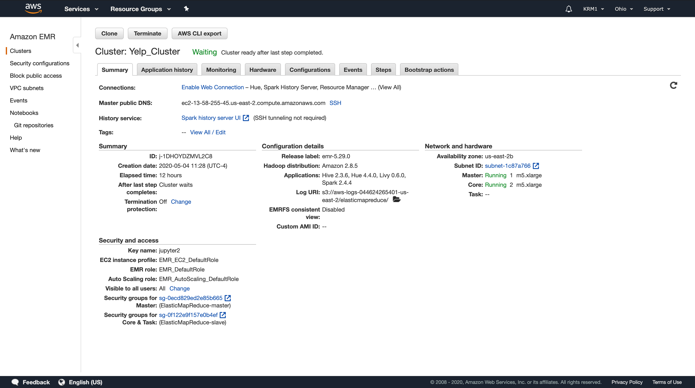
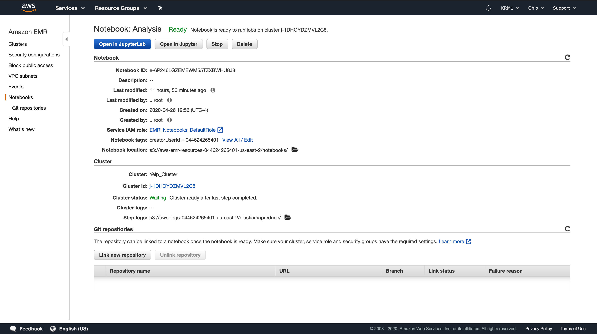

# 10GB Yelp Review Analysis
Utilizing 3 datasets (business, reviews, and user)

[Dataset Link](https://www.kaggle.com/yelp-dataset/yelp-dataset#yelp_academic_dataset_business.json)

Following are links for S3 hosted files: 
- business_df = spark.read.json('s3://myyelpbucket/yelp_business.json')
- review_df = spark.read.json('s3://myyelpbucket/yelp_review.json')
- user_df = spark.read.json('s3://myyelpbucket/yelp_user.json')

#### Cluster Configuration

#### Notebook Configuration

